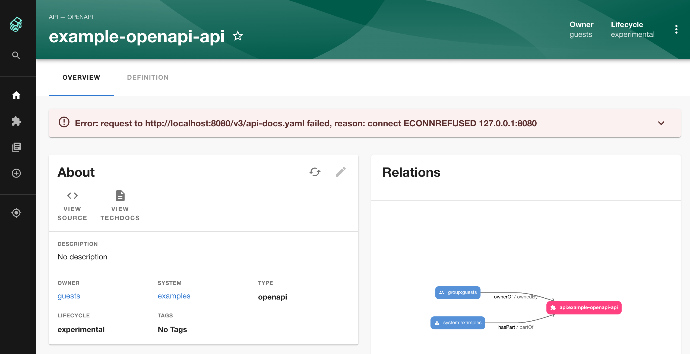

# OpenAPI Definition Sync Plugin

Website: TBD

## Motivation

API Entity definitions are needed to be kept in sync with the API implementation.

We use [springdoc](https://springdoc.org/) library to automate the generation of API documentation. Hence, the latest documentation for any service API is available to access through an actuator api.

This plugin provides a post process hook to update the entity definition in the Backstage backend with the latest API documentation fetched from the service. However, the plugin does not update the entity definition in the corresponding catalog-info.yaml.


## Features

-  Provides an Entity processor to keep the definition up-to-date.
-  Adds an error banner to the entity if the fetch is unsuccessful.

## Setup

### 1. Install the plugin to backend
```shell
yarn add --cwd packages/backend @thoughtworks-backstage/plugin-openapi-definition-sync-backend
```

### 2. Wire the `OpenApiEntityProcessor` in catalog backend.

Make following changes to the `packages/backend/src/plugins/catalog.ts` file 
```typescript
import { CatalogBuilder } from '@backstage/plugin-catalog-backend';
...
...
//Import OpenApiEntityProcessor from the plugin dependency
import { OpenApiEntityProcessor } from '@thoughtworks-backstage/plugin-openapi-definition-sync-backend';

export default async function createPlugin(
  env: PluginEnvironment,
): Promise<Router> {
  const builder = await CatalogBuilder.create(env);
  ...
  builder.addProcessor(new OpenApiEntityProcessor(env)); //Add OpenApiEntityProcessor to the builder.
  ...
  const { processingEngine, router } = await builder.build();
  await processingEngine.start();
  return router;
}
```
You can also refer the actual code [here](https://github.com/backstage-plugins/backstage-plugin-dev/commit/c52760d945d4a936f6fa46b53882077dd945a850).

This will ensure that the latest API documentation is fetched each time the entity state is refreshed either manually or through a poll.

### 3. Enable the plugin for API entities

Add following annotation to the API entities to enable the fetching of the API documentation from the service itself.

```
tw.com/openapi-doc-url: <URL of the documentation endpoint>
```

See an example below.

```yaml
apiVersion: backstage.io/v1alpha1
kind: API
metadata:
  name: example-openapi-api
  annotations:
    tw.com/openapi-doc-url: http://localhost:8080/v3/api-docs.yaml
spec:
  type: openapi
  lifecycle: experimental
  owner: guests
  system: examples
  definition: |
    openapi: 3.0.1
    info:
      title: OpenAPI definition
      version: v0
    servers: []
    paths: {}
    components:
      schemas: {}
```

## Screenshots

Screenshot belows shows an API entity page when API documentation fetch fails. This indicates that the entity definition in the Backstage catalog is no longer up to date with the source and a refresh is needed. However, the previously captured definition is still available for use.



## Limitations

Works only with API entities of type `openapi`.
